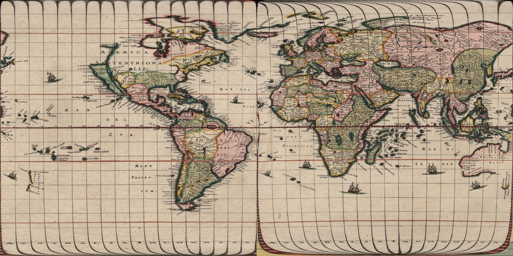
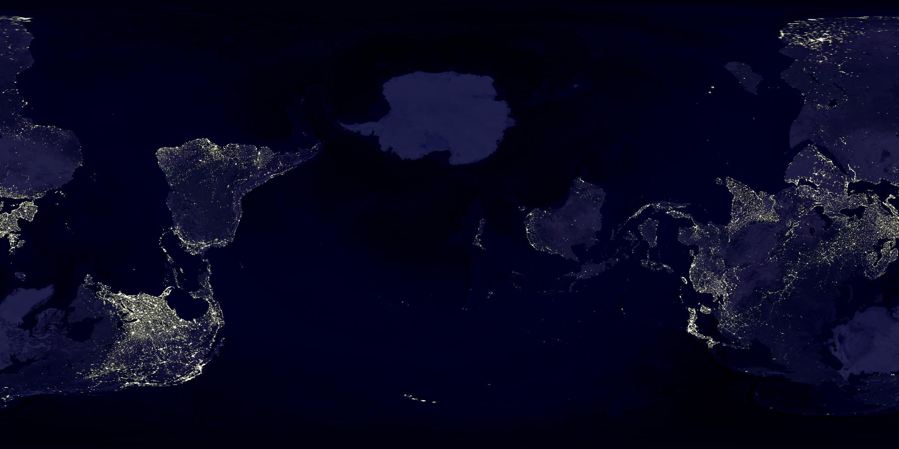
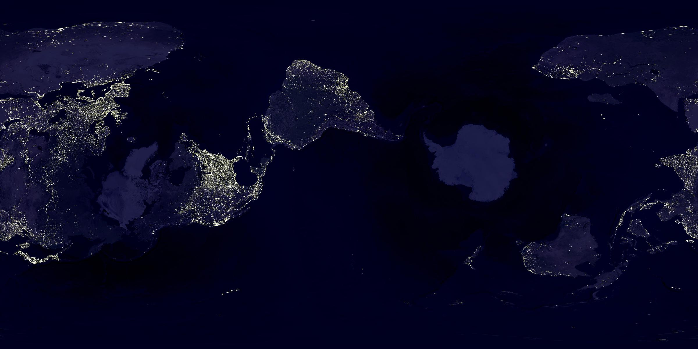

# Map Orientations

Many people are familiar with the controversies surrounding competing map projections.  You've probably seen the [Mercatur projection](https://en.wikipedia.org/wiki/Mercator_projection) criticized for showing northern (and southern) regions as much larger than equatorial regions of the same true area.  And you're probably familiar with the [Gall Peters](https://en.wikipedia.org/wiki/Gall–Peters_projection) or maybe the [Plate-carre](https://en.wikipedia.org/wiki/Equirectangular_projection) as alternatives.  

This repo is not about projections - instead it is concerned with the default _orientation_ of maps.  You can take any projection, rotate the globe a bit, re-project it with the same projection, and get an equally valid new map that just doesn't center the equator in the standard orientation.  This produces interesting and unusual maps that demonstrate the flaws of any projection.  If one of them looks very wrong, remember - the maps we're used to with the standard equatorial orientation are _just as wrong_!

## What is in here?

This repo contains a few notebooks and some script to generate interesting maps.  The maps are all standard projections, but with new orientations.

[This notebook](notebooks/map_orientations.ipynb) gives a quick overview with examples showing re-oriented cylindrical projections.  [This one](notebooks/explaining_map_orientations.ipynb) is a bit messier but it attempts to walk through all the actual logic and explain it.  It's me working through how to do this. 

[This notebook](notebooks/blaueu_stereographic.ipynb) is more recent and I think it's pretty cool - it takes Blaueu's _Terrarium Orbis_, one of the first stereographic projection maps, and rotates it.

I would like to
  * add a simple example gif rotating the globe a bit
  * clean up the stuff in projections.py - it's VERY old (5+ years) and is pretty gross
  * also clean up the Blaueu notebook 
  * unify the Blaueu stuff with the other stuff so I can show the Blaueu map with a cylindrical projection
  
There's going to be a lot of stuff talking about "projections" that I need to change to "orientations".  Projections is the wrong word.

# Examples

##  Rotating Blaueu's 1664 Terrarium Orbis

## Small Rotations

This one just rotates the globe a bit clockwise from the standard orientation.

And a small counterclockwise rotation:

This pulls the south pole up a bit.

And we can also pull the north pole down.

## Re-projecting Blaueu's Terrarium Orbis

We can also take Blaueu's dual stereographic map and reproject it into a cylindrical (equirectangular here) projection.

The artefacts here are a bit from the curvature of the scanned image, and a bit from me not being exact when pulling out the hemispheres.

##  Selected Maps

This code produces maps like these:

All we're doing here is rotating the globe.  We're not changing the projection math in any way - each of these maps is just as valid as the standard orientation maps you're used to.

